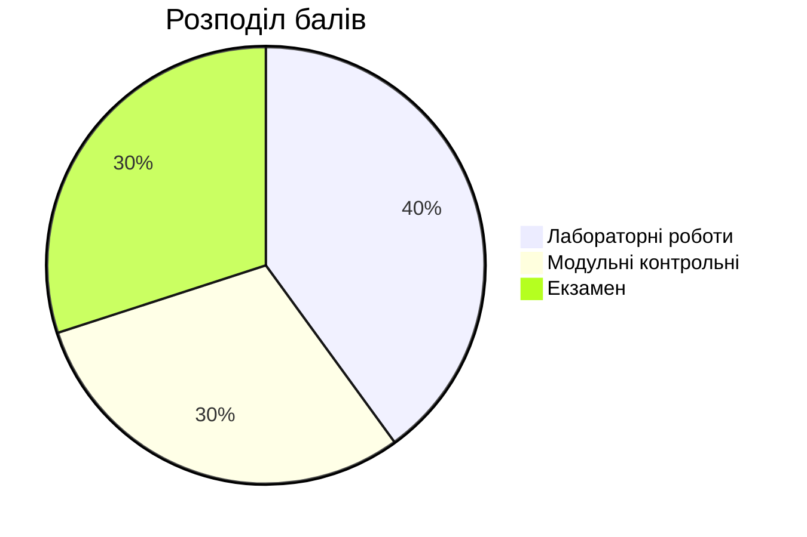

# 🗄️ Курс "Бази даних"

Ласкаво просимо на курс з баз даних! Тут ви знайдете всі необхідні матеріали для успішного опанування дисципліни.

## 📋 Про курс

**Семестр:** {{ site.course.semester }}  
**Кредити:** {{ site.course.credits }} ECTS  
**Загальний обсяг:** {{ site.course.hours.total }} годин

### Розподіл годин:
- 🎓 **Лекції:** {{ site.course.hours.lectures }} год
- 🧪 **Лабораторні:** {{ site.course.hours.labs }} год  
- 📚 **Самостійна робота:** {{ site.course.hours.independent }} год

## 🎯 Мета курсу

Після завершення курсу студенти зможуть:

✅ **Проектувати** бази даних для реальних застосунків  
✅ **Створювати** та модифікувати структури БД  
✅ **Писати** ефективні SQL запити  
✅ **Оптимізувати** роботу з базами даних  
✅ **Використовувати** сучасні СУБД у проектах  

## 📚 Структура курсу

### 🎓 [Лекції]({{ site.baseurl }}/lectures/)
- Теоретичні основи баз даних
- Проектування та моделювання
- SQL та оптимізація запитів
- Сучасні тренди в БД

### 🧪 [Лабораторні роботи]({{ site.baseurl }}/labs/)
- Практичні завдання
- Робота з реальними СУБД
- Проектування власних БД

### 📖 [Ресурси]({{ site.baseurl }}/resources/)
- Література та посилання
- Інструменти та ПЗ
- Додаткові матеріали

## 🗓️ Розклад лекцій

| Тиждень | Тема | Дата |
|---------|------|------|
| 1 | [Вступ до баз даних]({{ site.baseurl }}/lectures/01-vstup/) | 02.09.2025 |
| 2 | [Реляційна модель]({{ site.baseurl }}/lectures/02-relyacijna-model/) | 09.09.2025 |
| 3 | [ER-моделювання]({{ site.baseurl }}/lectures/03-er-modeling/) | 16.09.2025 |
| 4 | SQL: Основи | 23.09.2025 |
| 5 | SQL: Складні запити | 30.09.2025 |

## 📊 Система оцінювання

**Шкала оцінок:**
- 90-100 балів: Відмінно (A)
- 80-89 балів: Добре (B) 
- 70-79 балів: Добре (C)
- 60-69 балів: Задовільно (D)
- 50-59 балів: Задовільно (E)
- 0-49 балів: Незадовільно (F)

## 🚀 Швидкий старт

1. **Встановіть MySQL** за [інструкцією]({{ site.baseurl }}/labs/lab-01-install/)
2. **Перегляньте** першу лекцію про [основи БД]({{ site.baseurl }}/lectures/01-vstup/)
3. **Приєднайтеся** до групи в Telegram: [@db_course_2025](https://t.me/db_course_2025)

## 📞 Контакти

**Викладач:** {{ site.author.name }}  
**Email:** [{{ site.author.email }}](mailto:{{ site.author.email }})  
**Університет:** {{ site.author.university }}  
**Кафедра:** {{ site.author.department }}

**Години консультацій:** Четвер 14:00-16:00, ауд. 123

---

*Останнє оновлення: {{ site.time | date: "%d.%m.%Y" }}*
